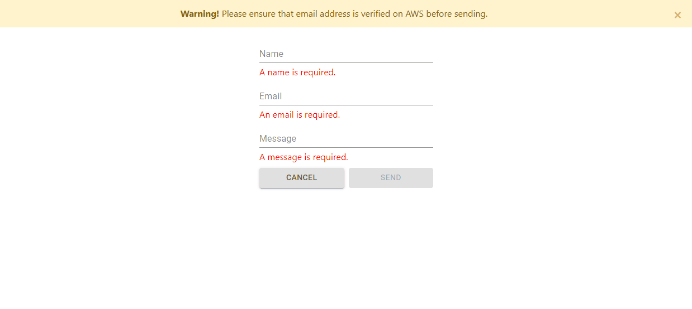
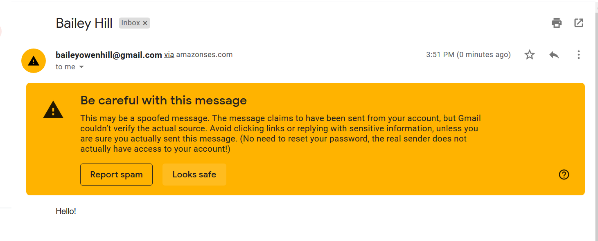
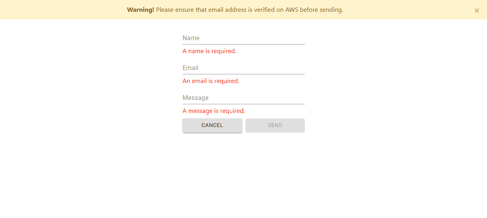

# Email Submission Form
A simple email contact form for a static web application.

## Technologies Used
- React.js
- MaterialUI
- HTML5
- Bootstrap 4
- CSS3
- AWS S3
- AWS SES

## Features
- User can send name, email, and message to AWS verified email address.

## Preview
### Sucessful email

### Failed email

## Development
### System Requirements
* Node.js 10 or higher
* NPM 6 or higher

### Getting Started
1. Clone the repository.

`git clone https://github.com/bailey-hill/email-submission.git`

`cd email-submission`

2. Install all dependencies with NPM.

`npm install`

3. Start the project. Once started you can view the application by opening http://localhost:3000 in your browser.

`npm start`
